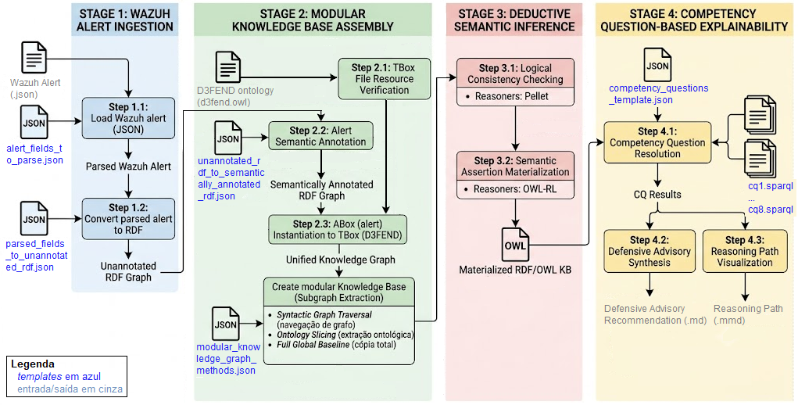

# DefendGraph: Sistema Especialista Semântico para Alertas Wazuh com MITRE D3FEND

**Descrição**: 
O DefendGraph consiste em um protótipo de sistema especialista semântico que recebe como entrada um alerta nativo do Wazuh e produz como saída recomendações de mecanismos defensivos. Essas recomendações são apresentadas ao usuário em dois formatos complementares: texto estruturado e um grafo esquemático que representa o encadeamento semântico da recomendação.

**Resumo do artigo 'DefendGraph: Sistema Especialista Semântico para Alertas Wazuh com MITRE D3FEND'**: 
O crescente grau de complexidade das redes modernas e dos ambientes de cibersegurança impõe desafios significativos à análise e interpretação de alertas gerados por ferramentas de SIEM. Nesses ambientes, o volume de eventos e a heterogeneidade dos dados dificultam a compreensão do contexto dos incidentes, aumentando a sobrecarga operacional dos analistas e limitando o processo de tomada de decisão. Este artigo apresenta um protótipo de sistema especialista semântico para apoiar a análise de alertas de cibersegurança e a recomendação de medidas defensivas. A abordagem proposta transforma alertas nativos do Wazuh em um grafo de conhecimento RDF/OWL enriquecido com a ontologia MITRE D3FEND, com o objetivo de ampliar a explicabilidade, a rastreabilidade e a representação formal das relações entre evidências observadas, técnicas adversárias e mecanismos de defesa. 

# Estrutura do projeto

```
DefendGraph/
├── app.py                     # Streamlit application entry point
├── pipeline_config.py         # Pipeline stages and steps configuration
├── requirements.txt           # Python dependencies
├── data/                      # Input data (D3FEND ontology, sample alerts, templates)
├── src/
│   ├── state.py               # Pipeline step state management
│   ├── models/                # Data model definitions
│   ├── owl2ready/             # OWL ontology operations (consistency, materialization, etc.)
│   ├── parsers/               # Auxiliary parsers
│   ├── rdflib/                # SPARQL queries, alert-to-RDF conversion, semantic annotation
│   ├── ui/                    # User interface (sidebar, tabs)
│   └── utils/                 # Utilities (advisory synthesis, visualization)
├── state/                     # Artifacts generated during pipeline execution
└── tests/                     # Unit tests
```

# Selos Considerados

Os autores indicam os seguintes selos a serem considerados: Disponíveis, Funcionais, Sustentáveis e Experimento Reprodutível. 

# Informações básicas
O DefendGraph consiste em um protótipo de sistema especialista semântico que recebe como entrada um alerta nativo do Wazuh e produz como saída recomendações de mecanismos defensivos. Essas recomendações são apresentadas ao usuário em dois formatos complementares: texto estruturado e um grafo esquemático que representa o encadeamento semântico da recomendação.

O problema central investigado neste trabalho não reside na melhoria da ingestão contínua, escalabilidade ou latência dos painéis de ferramentas SIEM, mas na lacuna de explicabilidade, inferência lógica e rastreabilidade na interpretação de alertas de cibersegurança. 

### Ambiente de execução
O protótipo pode ser executado em sistemas operacionais Windows ou Linux. Para ambientes Linux, recomenda-se o uso da distribuição Ubuntu. O sistema requer Python 3.10 ou superior e um navegador web, preferencialmente Google Chrome.

A execução do protótipo ocorre localmente, por meio de uma interface web disponibilizada na própria máquina do usuário.

### Requisitos de Hardware
Os testes e as avaliações do projeto foram realizados em um computador equipado com processador Intel Core i5-4200M, 8 GB de memória RAM e armazenamento SSD. Nesse ambiente, cada execução completa do pipeline levou aproximadamente cinco minutos.

### Vídeo de demonstração
O vídeo de demonstração está publicado em uma plataforma de compartilhamento de vídeos: https://www.youtube.com/watch?v=mpG0RzIeado

### Descrição da arquitetura do DefendGraph
Na Figura abaixo tem-se um esquemático da arquitetura do DefendGaph.


A descrição detalhada da arquitetura do DefendGraph encontra-se em [Arquitetura do DefendGraph](Arquitetura%20do%20DefendGraph.pdf)

# Dependências

Em síntese, o arcabouço tecnológico baseia-se na linguagem de programação Python, utilizando as bibliotecas **Owlready2**, **rdflib** e **OWL-RL** para manipulação de ontologias, inferência lógica e consultas SPARQL, e as bibliotecas **Streamlit**, **Streamlit-Mermaid** e **Streamlit-Cytoscape** para o desenvolvimento da interface do usuário e visualização das recomendações em formato textual, de gráficos e de grafos.

- Python 3.10+ 
- owlready2 --> DL reasoner
- owlrl --> DL reasoner
- rdflib --> RDF graph processing
- streamlit --> interactive web interface
- streamlit-mermaid --> esquematic graphs 
- streamlit-cytoscape --> knowledge graphs

# Preocupações com segurança

Os autores não identificam riscos à segurança associados à execução do artefato. A aplicação é executada localmente por meio do **Streamlit**, em ambiente controlado na máquina do avaliador, sem necessidade de privilégios administrativos ou alterações na configuração do sistema.

# Instalação

### 1. Clone o repositório

```bash
git clone https://github.com/felipethomas82/DefendGraph.git
cd DefendGraph
```

### 2. Crie e ative um ambiente virtual

```bash
python -m venv .venv
```

- **Linux/macOS:**
  ```bash
  source .venv/bin/activate
  ```
- **Windows:**
  ```bash
  .venv\Scripts\activate
  ```

### 3. Instale as dependências


```bash
pip install --upgrade pip
pip install -r requirements.txt
```

### 4. Execute a aplicação

```bash
streamlit run app.py
```

A interface será aberta no navegador padrão em http://localhost:8501.

# Teste mínimo e Experimentos

Carregar um alerta de exemplo

Na interface, utilize a guia do **Stage 1** em **Step 1.1: Load Wazuh alert (JSON)** para carregar um dos arquivos de exemplo disponíveis em:

```
data/samples wazuh alerts/alert_wazuh_example.json
data/samples wazuh alerts/alert_wazuh_sql_injection_example.json
```

Na guia do **Stage 2** em **Step 2.1: TBox File Resource Verification** para carregar a ontologia MITRE D3FEND em:

```
data/mitre d3fend ontology/d3fend.owl
```
Siga os **Steps** e **Stages** do **Pipeline**. O **Pipeline** de processamento está dividido em quatro estágios principais, acessíveis por meio de uma interface desenvolvida em **Streamlit**:

| Stage | Description |
|-------|-------------|
| **1. Wazuh Alert Ingestion** | Parsing of the raw Wazuh alert JSON and syntactic translation to RDF. |
| **2. Modular Knowledge Base Assembly** | Semantic annotation of the alert, ABox/TBox integration with the D3FEND ontology, and extraction of modular subgraphs. |
| **3. Deductive Semantic Inference** | Logical consistency checking (Pellet reasoner) and materialization of implicit semantic assertions. |
| **4. Competency Question-Based Explainability** | Resolution of predefined competency questions via SPARQL and synthesis of a defensive advisory with a reasoning graph. |

Maiores informações sobre cada **Stages**/**Steps** estão disponíveis em [Arquitetura do DefendGraph](Arquitetura%20do%20DefendGraph.pdf)

A execução das etapas do processo é parametrizada, sempre que viável, por meio de arquivos de configuração independentes. Os arquivos de configuração encontram-se em:

```
data/templates
```
Cada passo da arquitetura opera com entradas e saídas materializadas em formatos de arquivo padronizados. A geração  desses arquivos a cada transição de estado não apenas modulariza o sistema, como também viabiliza a auditoria completa de todo o ciclo de inferência. Estes arquivos encontram-se em:

```
state/
```
Maiores informações sobre esses arquivos encontram-se em:

```
pipeline_config.py
```

## License

Este projeto está licenciado sob a licença MIT. Consulte o arquivo [LICENSE](LICENSE) para mais detalhes.
